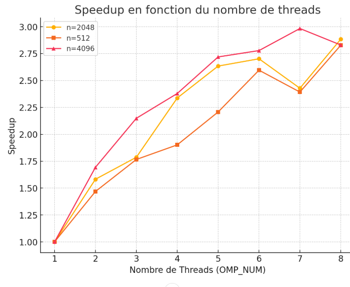

# TD1

`pandoc -s --toc README.md --css=./github-pandoc.css -o README.html`

## lscpu

CPU family:           6
    Model:                140
    Thread(s) per core:   2
    Core(s) per socket:   4
    Socket(s):            1
    Stepping:             1
    BogoMIPS:             3379.19

## Produit matrice-matrice

### Effet de la taille de la matrice

  n            | MFlops
---------------|--------
1024 (origine) |455.21
1023           |718.071
1025           |804.253
               |
               |

Il existe une différence notable dans l’exécution lorsque la taille d’une matrice est une puissance de 2 (comme dans le cas 1024).

Ce comportement s’explique par la manière dont la mémoire est gérée par le CPU et conçue au niveau matériel: lorsqu’on accède à une variable à la position i, il est courant d’utiliser ensuite celle à la position i+1. Le CPU suit ce principe et enregistre les variables de manière séquentielle.

La mémoire étant basée sur des structures binaires, elle a généralement une taille multiple de 2, donc le mécanisme de modulo peut entraîner des conflits d’accès en pointant vers les mêmes emplacements mémoire. Ainsi, chaque fois que le CPU doit enregistrer une variable, il peut être nécessaire de recopier les données, ce qui allonge le temps d’exécution.

### Permutation des boucles

Expliquer comment est compilé le code (ligne de make ou de gcc) : `make TestProduct.exe && ./TestProduct.exe 1024`

  ordre           | time    | MFlops  | MFlops(n=2048)
------------------|---------|---------|----------------
i,j,k (origine)   | 3.01559 | 712.128 |  300.051
j,i,k             | 5.73337 | 780.378 |  300.645
i,k,j             | 4.67748 | 770.844 |  593.807
k,i,j             | 4.94844 | 833.158 |  467.091
j,k,i             | 3.42219 | 804.924 |  319.618
k,j,i             | 2.43802 | 880.833 |  300.556

On remarque que les ordres kij, jki et kji sont ceux qui obtiennent les meilleures performances dans le cas n=1024, et les ordres jik et kij performment mieux pour n=2048. Il est attendu que jki et kji offrent de meilleures performances, car les données sont stockées par lignes. Ainsi, lorsqu'une de ces variables est dans la boucle intérieure, l'accès aux données est plus efficace, réduisant les défauts de cache et améliorant ainsi la vitesse d'exécution.

### OMP sur la meilleure boucle

`make TestProduct.exe && OMP_NUM_THREADS=8 ./TestProduct.exe 1024`

  OMP_NUM         | MFlops  | MFlops(n=2048) | MFlops(n=512)  | MFlops(n=4096)
------------------|---------|----------------|----------------|---------------
1                 | 3372.17 |    3022.06     |    3566.06     |    2738.27
2                 | 5243.13 |    4782.02     |    5236.69     |    4636.26
3                 | 6756.2  |    5398.35     |    6297.19     |    5883.8
4                 | 7811.38 |    7062.94     |    6781.57     |    6514.5
5                 | 8006.53 |     7960       |    7871.79     |    7445.1
6                 | 9183.03 |    8164.87     |    9256.56     |    7607.23
7                 | 9473.96 |    7337.44     |    8532.05     |    8168.87
8                 | 9756.51 |    8716.24     |    10083.9     |    7748.53

Le graphique montre l'évolution de l'accélération (speedup) en fonction du nombre de threads pour différentes tailles de matrice (n). De manière générale, on observe que le speedup augmente avec le nombre de threads, mais l'efficacité commence à diminuer après un certain seuil. Pour n = 512, l'accélération est plus marquée, atteignant presque trois fois la performance initiale avec huit threads. En revanche, pour n = 2048 et n=4096, le speedup est plus irrégulier, notamment pour n=4096, où il semble se stabiliser après six threads. Ce phénomène peut s’expliquer par la surcharge de synchronisation entre les threads et un éventuel goulot d’étranglement dans l’accès à la mémoire, limitant ainsi l’évolutivité. Globalement, l’augmentation du nombre de threads améliore les performances, mais l’efficacité du parallélisme est influencée par des facteurs tels que la communication entre les threads et l’architecture matérielle utilisée.

### Produit par blocs

`make TestProduct.exe && ./TestProduct.exe 1024`

  szBlock         | MFlops  | MFlops(n=2048) | MFlops(n=512)  | MFlops(n=4096)
------------------|---------|----------------|----------------|---------------
32                | 5882.58 |    2931.14     |    4975.91     |    2067.54
64                | 6775.07 |    4158.95     |    6866.75     |    2890.03
128               | 8544.9  |    5990.78     |    5411.08     |    4192.82
256               | 7133.25 |    7506.24     |    4563.99     |    6119.68
512               | 5753.79 |    6667.3      |    3119.98     |    7651.25
1024              | 3341.95 |    4421.21     |      ---       |    6585.55

On remarque que pour chaque taille n de matrice, la performance atteint un maximum pour une certaine valeur de szBlock, puis commence à diminuer progressivement. Par exemple, pour n=2048, la meilleure performance est obtenue avec szBlock=256 (7506,24 MFlops), tandis que pour n=4096, c’est avec szBlock=512 (7651,25 MFlops). Pour une plus petite matrice comme n=512, la performance maximale est atteinte avec szBlock=64 (6866,75 MFlops).

Cela s’explique par la manière dont les données sont chargées et stockées en mémoire. Si szBlock est trop petit, on ne profite pas assez du cache, ce qui oblige le programme à accéder plus souvent à la mémoire principale, ralentissant l’exécution. En augmentant szBlock, on améliore l’utilisation du cache et donc les performances. Mais si szBlock devient trop grand, il peut dépasser la capacité du cache, ce qui entraîne plus de défauts de cache et ralentit à nouveau le programme. C’est pour cela qu’on observe une baisse des performances après un certain point.

### Bloc + OMP

  szBlock      | OMP_NUM | MFlops  | MFlops(n=2048) | MFlops(n=512)  | MFlops(n=4096)|
---------------|---------|---------|----------------|----------------|---------------|
1024           |  1      | 3501.67 |    2944.47     |      ---       |    2817.59    |
1024           |  8      | 3383.41 |    4624.41     |      ---       |    6560.78    |
512            |  1      | 3465.53 |    2845.43     |    3589.52     |    2617.89    |
512            |  8      | 4872.42 |    6776.03     |    3553.88     |    7717.88    |

En comparant les performances avec un seul thread (OMP_NUM = 1), on observe que la taille du bloc a un impact limité. Pour szBlock = 1024, les performances sont légèrement supérieures à celles de szBlock = 512, sauf pour n = 4096, où szBlock = 512 donne de meilleurs résultats (2617,89 MFlops contre 2817,59 MFlops). Cela suggère que, lorsqu'un seul thread est utilisé, la gestion du cache joue un rôle clé, et la taille du bloc seule ne suffit pas à améliorer significativement les performances.

Lorsque le parallélisme est activé (OMP_NUM = 8), on remarque une amélioration importante des performances, notamment pour n = 2048 et n = 4096. Avec szBlock = 512, on atteint respectivement 6776,03 et 7717,88 MFlops, contre 4624,41 et 6560,78 MFlops pour szBlock = 1024. Cela indique que, pour de grandes tailles de matrice, une taille de bloc plus petite permet une meilleure répartition du travail entre les threads, optimisant l’accès aux données et réduisant les conflits liés au cache.

### Comparaison avec BLAS, Eigen et numpy

               |     MFlops     | MFlops(n=2048) | MFlops(n=512)  | MFlops(n=4096)|
---------------|----------------|----------------|----------------|---------------|
Bloc + OMP     |    5882.58     |    2931.14     |    4975.91     |    2067.54    |
BLAS           |    2941.29     |    1461.65     |    2487.48     |    1033,48    |

L’approche "Bloc + OMP" est environ deux fois plus rapide que "BLAS" pour toutes les tailles de matrice testées. Par exemple, pour n = 2048, "Bloc + OMP" atteint 2931.14 MFlops, contre 1461.65 MFlops pour "BLAS". La meilleure performance est observée pour n = 512, avec 4975.91 MFlops pour "Bloc + OMP" et 2487.48 MFlops pour "BLAS". Cependant, lorsque la taille de la matrice augmente, les performances diminuent en raison des accès mémoire plus coûteux et des limitations du cache. Pour n = 4096, cette baisse est significative, avec 2067.54 MFlops pour "Bloc + OMP" et 1033.48 MFlops pour "BLAS". 
En conclusion, l’optimisation avec OpenMP et la blocage améliore considérablement les performances, mais l’efficacité diminue pour de grandes matrices.